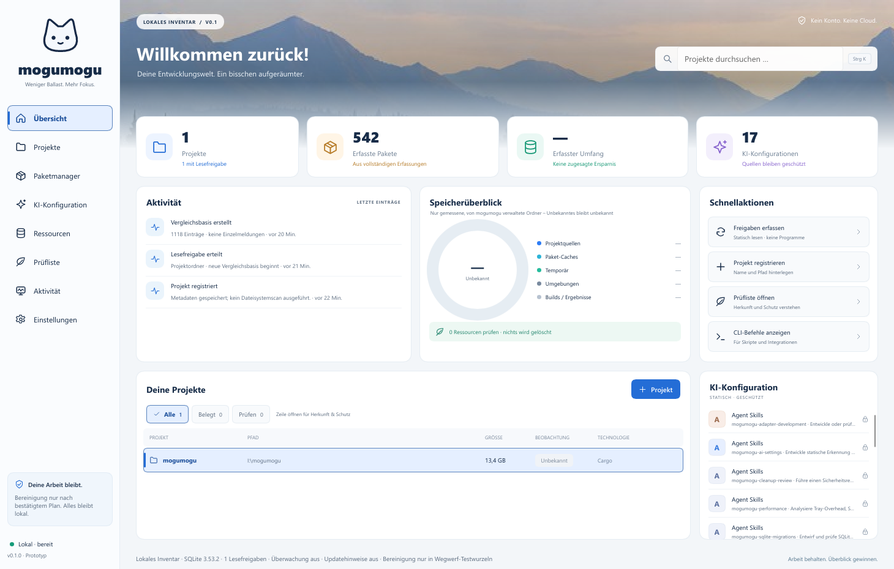

# mogumogu

**Lokales Entwicklungsinventar als Windows-Tray-App · Windows 10/11 · Rust · Slint · SQLite · GPL-3.0-only**

mogumogu zeigt, welche Entwicklungsressourcen auf deinem Rechner existieren, wem sie gehören, welche Nutzung tatsächlich beobachtet wurde und was eine Prüfung verdient: Projekte, Pakete aus neun Paketmanagern, Python-Umgebungen, Build-Ausgaben, Scratchpads und die KI-Konfiguration von zwölf Clients. Alles bleibt lokal – kein Konto, keine Cloud, keine Telemetrie.



> **Grundsatz:** Keine beobachtete Nutzung ist kein Entbehrlichkeitsnachweis. Registrieren erlaubt kein Lesen, Lesen erlaubt kein Löschen, und Bereinigung ist in dieser Version auf verwaltete Temp-Ausgabe in ausdrücklich markierten Wegwerf-Testwurzeln beschränkt.

## Stand

Alle Arbeitspakete F-01 bis F-28 des [Implementierungsplans](docs/IMPLEMENTIERUNGSPLAN.md) sind umgesetzt, nativ gebaut und auf Windows 10 (22H2) automatisiert und manuell geprüft. Offen sind die Windows-11-Abnahme und der unabhängige Review der Löschpfade (Gate G5); bis dahin ist produktive Bereinigung gesperrt. Details: [Validierung](docs/VALIDIERUNG.md), [Messbericht](docs/MESSBERICHT.md), [Unterstützungsmatrix](docs/UNTERSTUETZUNGSMATRIX.md).

| Fähigkeit | Umfang |
|---|---|
| Tray und Dashboard | Acht Ansichten nach dem Naturdesign, Fenster bei Bedarf, Tastaturnavigation, einheitliche Auswahl- und Fokuszustände; Lokalmodus als Standard, Demo separat |
| Lesefreigaben | Pro Ordner, an die Ordneridentität gebunden; Junctions, Symlinks und Cloud-Platzhalter werden nie verfolgt |
| Inventar | npm, pnpm, pip, uv, Cargo, NuGet statisch je Projekt; Scoop, Chocolatey, Windows-Softwareliste systemweit; deklariert/aufgelöst/installiert getrennt |
| KI-Konfiguration | Agent Skills, Codex, Claude Code, Copilot/VS Code, Cursor, Gemini, Windsurf, Cline, Roo, OpenCode, Continue, Aider – als Daten, nie ausgeführt |
| Generationen | Vergleichsbasis ohne Meldungsflut, gruppierte Änderungen, keine falschen Entfernungen nach Teilläufen |
| Scratchpads und Sessions | Verwaltete Struktur, Läufe in Job-Objekten, „unklar“ statt Scheinabschluss |
| Prüfliste und Bereinigung | Hinweise mit Evidenz, Plan per Fingerabdruck, journalisierte Ausführung, Abgleich nach Absturz |
| Updatehinweise | Aus, bis einzelne öffentliche Quellen freigegeben werden; private Quellen nie |
| CLI | Client des Besitzerprozesses über eine benutzergebundene Named Pipe, versioniertes JSON |

## Schnellstart

Voraussetzungen: Windows 10/11 x64, [rustup](https://rustup.rs) mit MSVC-Toolchain (die Version legt `rust-toolchain.toml` fest), Visual Studio C++ Build Tools mit Windows SDK.

```powershell
.\build.ps1                          # testen, Release bauen, lokales Inventar im Tray starten
.\build.ps1 -ShowDashboard           # lokales Inventar direkt öffnen
.\start.ps1 -ShowDashboard           # bereits gebaut mit lokalen Daten starten
```

Alternativ `build.cmd` doppelklicken (setzt die Execution Policy nur für diesen Prozess). Ausgabe: `dist\mogumogu\mogumogu.exe` und `mogumogu-cli.exe`. Kein Autostart, kein Dienst, keine Installation von Voraussetzungen.

Der normale Start verwendet deine lokale Datenbank. Neue Inventare beginnen leer: Projekt registrieren, dessen Lesefreigabe erteilen und erfassen. Die separate Vorschau mit Beispieldaten startet nur ausdrücklich mit `-Mode Demo`; eine laufende Instanz vorher im Tray beenden.

```powershell
$cli = '.\dist\mogumogu\mogumogu-cli.exe'
& $cli project register --name api --path C:\dev\api
& $cli project approve --project 1
& $cli scan
& $cli review
```

Die vollständige Bedienung inklusive Scratchpads, verwalteten Läufen und dem Testexecutor beschreibt die [Anleitung](docs/ANLEITUNG.md).

## Architektur

Ein Cargo-Paket mit klar getrennten Modulen. Genau ein **Besitzerprozess** (Tray oder `--headless`) hält die Datenbank; Dashboard und CLI rufen dieselben Anwendungsfälle auf.

```text
src/main.rs, src/desktop/   Tray, Dashboard-Lebenszyklus, Snapshot → Slint-Modelle
src/bin/cli/                CLI als Pipe-Client (startet den Besitzer bei Bedarf)
src/owner.rs                Ein Worker (einzige Schreibstelle), IPC-Server, Watcher
src/service/                Anwendungsfälle und versioniertes Befehlsprotokoll
src/domain/                 Typisierte Zustände und Zustandsautomaten (ohne I/O)
src/storage/                SQLite: Migrationen, Generationen, Journal, Wiederanlauf
src/platform/               Einzige Stelle mit Windows-FFI (unsafe, dokumentiert)
src/fsread.rs               Identitätsgebundenes, begrenztes Lesen
src/inventory/              Statische Erfassung und Größenmessung
src/adapters/               Neun Paketmanager-Adapter mit Fähigkeitsvertrag
src/profiles/               KI-Katalog (profiles/ai-catalog.toml) und Parser
src/parsers/                JSON/JSONC, TOML, XML ohne DTD, Frontmatter, YAML-Teilmenge
src/sessions/               Scratchpads, verwaltete Läufe, Sessionabgleich
src/review.rs, src/cleanup/ Prüfregeln, Planer, Ausführer, Abgleich
src/updates/                Opt-in-Updatehinweise
src/privacy.rs, export.rs   Redaktion und reduzierter Export
ui/                         Slint: Theme, Komponenten, Seiten, Dialoge
```

Sicherheitsmodell in Kürze: Wurzeln werden einmal geöffnet und mit ihrer freigegebenen Identität verglichen; darunter wird jede Komponente **relativ zum Elternhandle** (`NtCreateFile`) ohne Folgen von Reparse Points geöffnet – ein nachträglich eingeschleuster Link kann den Zugriff nicht umleiten. Entfernt wird über genau das Handle, dessen Identität gerade geprüft wurde, nachdem die Aktion dauerhaft im Journal steht.

## Entwicklung

Gemeinsamer Prüfeinstieg: `python scripts/check.py` (Windows: Kern und Desktop;
Linux: portabler Kern). Reproduzierbar mit der festgelegten Rust-Toolchain im Container:

```powershell
docker compose run --build --rm checks
```

Docker dient der Entwicklung und den Kernprüfungen. Tray, Dashboard und die
Windows-Sicherheitsgrenzen werden weiterhin nativ geprüft. Details und
Cache-Nutzung: [Docker](docs/DOCKER.md); Änderungswege und UI-Modulaufbau:
[Entwicklung](docs/ENTWICKLUNG.md).

```powershell
python scripts/validate.py
cargo fmt --all -- --check
cargo clippy --locked --all-targets -- -D warnings
cargo test --locked --no-default-features --features network
```

Regeln für Mitwirkende und Coding-Assistenten stehen in [AGENTS.md](AGENTS.md) (Claude Code: [CLAUDE.md](CLAUDE.md)); projektspezifische Skills liegen unter `.agents/skills/` und als Kopie unter `.claude/skills/`. Beiträge: [CONTRIBUTING.md](CONTRIBUTING.md), Sicherheit: [SECURITY.md](SECURITY.md).

Weitere Dokumente: [Produktplan](docs/PROJEKTPLAN.md) · [Implementierungsplan](docs/IMPLEMENTIERUNGSPLAN.md) · [Windows-Abnahme](docs/WINDOWS-ABNAHME.md) · [Quellen](docs/QUELLEN.md) · [Designvorschau (HTML)](design/dashboard.html)

## Lizenz

GPL-3.0-only, siehe [LICENSE](LICENSE). Hinweise zu Slint, SQLite, Abhängigkeiten und Bildmaterial: [THIRD_PARTY.md](THIRD_PARTY.md).
